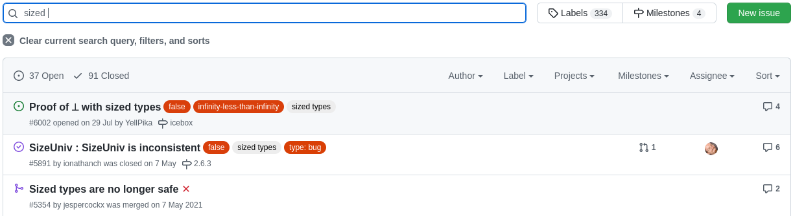

<style>
{
  font-size: 25px
}
</style>

<!-- _footer: Edoardo Marangoni -->
<!-- _class: lead -->
# MiniAgda 
Terminazione e produttività con *sized-types*.

---

<!-- _class: agenda -->
## Agenda 
- **Introduzione**
- **Tipi induttivi**
  *Controllare la terminazione. Regole (intuitive) per il controllo della terminazione e implementazione in MiniAgda.*
- **Tipi co-induttivi**
  *Controllare la produttività. Guardedness non tipata (sintattica) e tipata.*

---

## Introduzione 
Nei proof assistant, la totalità è necessaria per mantenere la **consistenza** del sistema: se, infatti, ammettiamo definizioni ricorsive non terminanti, si possono dimostrare teoremi falsi.
``` coq
Parameter bad : nat -> nat.
Axiom bad_ax : forall x, bad x = 1 + (bad x).

Theorem n_neq_sn : forall (x:nat), (x = S x) -> False.
Proof. intros.  induction x.
  + inversion H.
  + inversion H.  apply IHx in H1. assumption.
Qed.

Theorem zero_eq_one: 0 = 1.
  assert (bad 0 = 1 + (bad 0)).
  + apply bad_ax.
  + destruct bad; simpl in H.
    * assumption.
    * apply n_neq_sn in H. exfalso. assumption.
Qed.
```

---
## Introduzione
Oltre ai motivi di consistenza logica, in un linguaggio con tipi dipendenti la **totalità** è necessaria anche per assicurare la terminazione della fase di type-checking.

``` agda
 fooIsTrue : foo == true
 fooIsTrue = refl
```
Per mostrare che `refl` sia una dimostrazione del fatto che `foo == true`, Agda impiega il type checker per mostrare che `foo` sia effettivamente "riscrivibile" in `true`; se `foo` non termina, allora nemmeno il type-checker termina. Ci concentriamo su **terminazione** e **produttività**, ossia due criteri per decidere se permettere delle definizioni di funzione ricorsive e co-ricorsive in linguaggi totali. 

---

## Tipi induttivi

Esempio basilare in Coq
``` coq 
Inductive Nat : Type := 
  | zero : Nat 
  | succ : Nat -> Nat

(* ricorsione primitiva *)
Fixpoint minus (x y : Nat) : Nat := 
  match x with 
  | zero => zero 
  | succ x' => match y with 
               | zero => succ x'
               | succ y' => minus x' y' 
               end
  end.

(* termina? *)
Fixpoint div (x y : Nat) :  Nat := z
match x with 
| zero => zero
| succ x' => succ (div (minus x y) y)
end.
```
---

## Tipi induttivi
...e in Agda
``` agda
data Nat : Set where 
  zero : Nat 
  succ : Nat -> Nat 

-- ricorsione primitiva
minus : Nat -> Nat -> Nat 
minus zero _ = zero
minus (succ x) zero = succ x
minus (succ x) (succ y) = minus x y

-- termina?
div : Nat -> Nat -> Nat 
div zero _ = zero 
div (succ x) y = succ (div (minus x y) y)
```

Le definizioni di `div` ovviamente terminano: vengono accettate?

---

<!-- _class: fact -->
## no
``` coq
Cannot guess decreasing argument of fix.
```
``` agda
Termination checking failed for the following functions:
  div
Problematic calls:
  div (minus x y) y
```
Coq e Agda basano il controllo della terminazione sulla sintassi e non sono pertanto in grado di catturare informazioni semantiche rilevanti come, per esempio, il fatto che per ogni argomento $x$ e $y$, $minus ~ x ~ y \leq x$: pertanto, la definizione di $div$ non può essere accettata.

*"The **untyped** approaches have some shortcomings, including the sensitivity of the termination checker to syntactical reformulations of the programs, and a lack of means to propagate size information through function calls."*  [[A. Abel, MiniAgda]](https://arxiv.org/abs/1012.4896)

---

## Tipi induttivi: terminazione (in agda) 

 Non tutte le funzioni ricorsive sono permesse: Agda, per esempio, accetta solo quegli schemi ricorsivi che riesce a dimostrare terminanti. 

- **Ricorsione primitiva**
Un argomento di una chiamata ricorsiva deve essere *esattamente* più piccola "di un costruttore".
``` agda 
plus : Nat -> Nat -> Nat
plus zero    m = m
plus (suc n) m = suc (plus n m)
```
- **Ricorsione strutturale**
Un argomento di una chiamata ricorsiva deve essere una *sottoespressione*.
``` agda
fib : Nat -> Nat
  fib zero          = zero
  fib (suc zero)    = suc zero
  fib (suc (suc n)) = plus (fib n) (fib (suc n))
```
[[ref]](https://wiki.portal.chalmers.se/agda/ReferenceManual/Totality#Terminationchecking)

---

## Sized-types: intuizione
Sono un approccio **tipato**: annotiamo i tipi con una *size* (o *taglia*) che esprime un'informazione sulla dimensione dei valori di quel tipo. MiniAgda è "la prima implementazione *matura* di un sistema con sized-types". [[ref]](https://arxiv.org/abs/1012.4896)

Per quanto riguarda la terminazione, l'idea di base è la seguente:
- Associamo una *taglia* $i$ ad ogni tipo induttivo $D$;
- Controlliamo che la taglia diminuisca nelle chiamate ricorsive.

---
## Tipi induttivi sized: implementazione
- **Altezza**
L'**altezza** di un elemento induttivo $d \in N$ è il *numero di costruttori* di $d$. Possiamo immaginare $d$ come un albero in cui i nodi sono i costruttori: per esempio, l'altezza di un numero naturale $n$ è $n+1$ (perché c'è il costruttore $zero$ come foglia con $n$ costruttori $succ$); l'altezza di una lista di lunghezza $n$ è $n+1$ (perché c'è il costruttore $nil$).

- **Taglia**
Dato un certo tipo induttivo $N$ associamo ad esso una taglia $i$, ottenendo un tipo $N^i$ che contiene solo quei $d$ la cui altezza **è minore** di $i$, ossia ogni $d \in N^i$ ha un'altezza che ha come **upper bound** la taglia $i$. In altre parole, dato un elemento induttivo $d \in N^{i}$, sappiamo che possiamo "smontare" $d$ nei suoi costruttori al più $i-1$ volte. In un linguaggio d.t. possiamo modellare la taglia come un tipo $Size$ e i *sized-types* come membri di $Size \rightarrow Set$ (nel caso semplice senza polimorfismo del tipo sottostante). Definiamo, inoltre, la funzione *successore* sulle taglie $\uparrow : Size \rightarrow Size$ tale per cui $(\uparrow i) > i$.

(Nota: nell'articolo di Abel la funzione successore è indicata col simbolo $\$$. Ci atteniamo alle definizioni della libreria di Agda e usiamo $\uparrow$.)

---
## Tipi induttivi sized: implementazione
Definiamo i numeri naturali *sized* come membri di $Size \rightarrow Set$.
``` agda
-- Naturali *sized*
--         |--------| parametro implicito
--         v        v
data Nat : {i : Size} -> Set where
    zero : {i : Size} -> Nat {↑ i} 
    succ : {i : Size} -> Nat {i} -> Nat {↑ i}

```
Il costruttore $zero$ ha tipo $\forall i ~ SNat^{\uparrow i}$ perché la taglia è un *upper bound*: anche se interpretiamo il costruttore `zero` come un albero con un singolo nodo (pertanto con altezza $1$), vogliamo modellare il fatto che la sua taglia sia $i \geq 1$.

---

## Tipi induttivi sized: implementazione

- **Sottotipi**
Per quanto appena detto, viene naturale per i tipi induttivi, la regola di sottotipizzazione $N^i \leq N^{\uparrow i} \leq \cdots \leq N^{\omega}$ dove $N^{\omega}$ è un elemento la cui altezza è ignota (nella sintassi di Agda, la *taglia ignota* è $\infty$).

- **Dot patterns** 
Definendo alcune funzioni (come `minus` nella prossima slide), per mantenere la linearità della parte sinistra del pattern-match è necessario utilizzare i *dot patterns*, usati quando l'unico valore ben tipato per un argomento è definito da un pattern per un altro argomento, distinguendo quindi tra patterni ordinari e pattern *inaccessibili*.

- **Parametricità**
Le taglie sono usate solo durante il type checking, pertanto devono poter essere rimosse una volta conclusa tale fase: di conseguenza, i risultati di una funzione non devono essere dipendenti dalle taglie degli argomenti. 
--- 

## Tipi induttivi sized: implementazione
``` agda
monus : {i : Size} -> Nat {i} -> Nat {∞} -> Nat {i}
monus .{↑ j} (zero {j}) n = zero {j}
monus .{↑ j} (succ {j} x) (zero {∞}) = succ {j} x
-- anche se `minus x y` ha una taglia strettamente minore di i, il tipo del
-- risultato è SNat i (e questo caso, `minus x y`, è ben tipato per
-- sottotipizzazione); in altre parole, l'informazione che in questo caso il
-- risultato ha taglia strettamente minore di x è persa. 
monus .{↑ j} (succ {j} x) (succ {∞} y) = monus {j} x y

-- Divisione euclidea *sized*
div : {i : Size} -> Nat {i} -> Nat {∞} -> Nat {i}
div .{↑ j} (zero {j}) y = zero {j}
div .{↑ j} (succ {j} x) y = succ (div {j} (monus {j} x y) y)
```
Nella definizione di $div$, siccome $x$ ha taglia $j < i$, lo stesso vale anche per $minus~x~y$: la chiamata ricorsiva a $div$ avviene sulla taglia $j$ strettamente minore di $i$; questo permette di dimostrare la terminazione della funzione.

---
## Tipi induttivi sized: esempio meno banale
``` agda
data List (A : Set) : Set where
  nil : List A 
  cons : A -> List A -> List A

mapList : {A : Set} -> {B : Set} -> (A -> B) -> List A -> List B
mapList f nil = nil 
mapList f (cons a x) = cons (f a) (mapList f x)

data Rose (A : Set) : Size → Set where
  rose : {i : Size} -> A -> List (Rose A i) → Rose A (↑ i)

mapRose : {A : Set} -> {B : Set} -> (A -> B) -> {i : Size} -> Rose A i -> Rose B i
mapRose f (rose a rs) = rose (f a) (mapList (mapRose f) rs)
```

Senza *sized-types*: 
``` agda
Termination checking failed for the following functions:
  mapRose
Problematic calls:
  mapRose f
```

---

## Tipi co-induttivi
Nonostante sia necessaria la totalità, possiamo lo stesso "osservare" oggetti infiniti tramite la *co-induzione*, concetto duale all'induzione. L'esempio principale dei tipi co-induttivi è quello degli *stream*. Esempio basilare in Coq
``` coq
CoInductive NatStream : Type := cons { hd: nat; tail: NatStream }.
CoFixpoint countFrom (n:nat) := cons nat n (countFrom (n+1)). (* =*> (cons n (cons n+1 (cons n+2 (...)))) *)
```
...e in Agda 
``` agda
record NatStream : Set where
  coinductive
  constructor _::_
  field
    head : Nat
    tail : NatStream

open NatStream public 

countFrom : Nat -> NatStream 
head (countFrom x) = x 
tail (countFrom x) = countFrom (x + 1)
```

---
## Tipi co-induttivi: guardedness
Non possiamo richiedere la *terminazione* di una funzione come `countFrom` (che, per definizione, non termina); invece, richiediamo la **produttività**: *"[...] we require productivity, which means that the next portion can always be produced in finite time. A simple criterion for productivity which can be checked syntactically is guardedness.."* [[ref]](https://arxiv.org/pdf/1012.4896.pdf)

In Agda, il controllo della produttività di una funzione co-ricorsiva è basato sulla *guardedness* della definizione, ossia richiediamo che la definizione di una funzione (la parte destra) sia un (co-)costruttore e che ogni chiamata ricorsiva sia direttamente "sotto" esso. Questa definizione è accettata per *guardedness*:
``` agda 
repeat : Nat -> NatStream
head (repeat x) = x 
tail (repeat x) = repeat x
```

---

## Tipi co-induttivi: guardedness
Questa dipende da $F$:
``` agda 
repeatF : Nat -> (NatStream -> NatStream) -> NatStream
head (repeatF x _) = x 
tail (repeatF x f) = f (repeatF x f)
```
se $F$ è, esempio, $tail$, la definizione si riduce a sé stessa dopo una ricorsione: 
```
tail (repeat a) -> tail (a :: tail repeat a) -> tail repeat a -> ...
```
se invece $F$ mantiene la lunghezza dello stream o la incrementa, `repeatF` è produttiva; i controlli puramente sintattici, però, non possono catturare questo aspetto.

(Nota: tornando agli esempi precedenti, il controllo sulla terminazione della funzione `div` fallisce perché il controllo sintattico non riesce a "capire" che `monus` diminuisce (o lascia intatto) il parametro `x`; qui accade l'opposto: il controllo fallisce se non riesce a "capire" che `F` incrementa lo stream o lo lascia intatto.)

---
## Tipi co-induttivi sized: implementazione
- **Profondità**
La **profondità** di un elemento coinduttivo $d \in D$ è il *numero di co-costruttori* di $d$. Uno stream interamente costruito avrà profondità $\omega$.

- **Taglia**
Dato un certo tipo co-induttivo $C$ associamo ad esso una taglia $i$, ottenendo un tipo $C^i$ che contiene solo quei $d$ la cui profondità **è maggiore** di $i$, ossia ogni $d \in C^i$ ha una profondità che ha come **lower bound** la taglia $i$. In altre parole, dato un elemento co-induttivo $d \in C^{i}$, sappiamo che possiamo "osservare" $d$ nei suoi costruttori almeno $i$ volte. 

``` agda
record NatStream {i : Size} : Set where 
  coinductive
  constructor _::_
  field 
    head : Nat 
    --          |-----| j di tipo `Size` minore di `i`
    --          v     v
    tail : {j : Size< i} -> NatStream {j}
```
---
## Tipi co-induttivi sized: implementazione

La funzione `countFrom` con i sized-types:
``` agda
countFrom : {j : Size} -> Nat -> NatStream {j}
head (countFrom {_} x) = x
tail (countFrom {j} x) {i}  = countFrom {i} (x + 1)
```

- **Sottotipi**
Dualmente, se per i tipi induttivi vale $I^i \leq I^{\uparrow i} \leq \cdots \leq I^{\omega}$, per i tipi co-induttivi vale l'opposto: $C^i \geq C^{\uparrow i} \geq \cdots \geq C^{\omega}$ dove $C^{\omega}$ è un elemento la cui profondità è ignota.

Possiamo quindi definire `repeatF` come segue:
``` agda
repeatF : {i : Size}  -> Nat -> ({j : Size< i} -> NatStream {j} -> NatStream {j})  -> NatStream {i}
head (repeatF n _) = n 
tail (repeatF n f) = f (repeatF n f)
```
in questo modo assicuriamo al type checker che la funzione `f` non diminuisce la profondità del suo argomento. 

---
## Sized-types: caveat 

